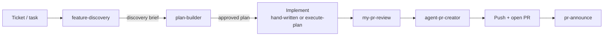
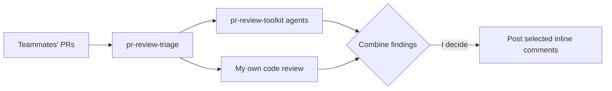
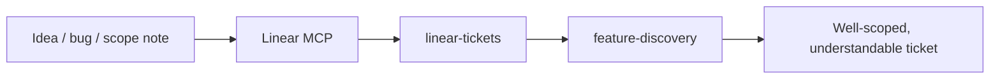
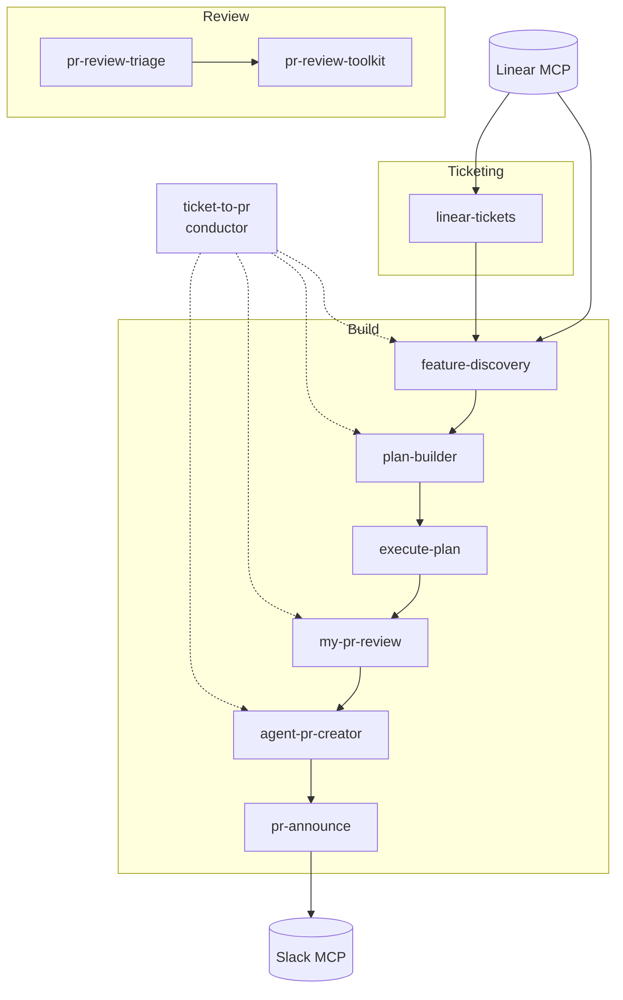

# Workflows

How I actually use these tools together. Three main flows: **building a feature**,
**reviewing other people's PRs**, and **creating tickets**.

---

## 1. Building a feature (my core loop)

For every task I pick up, I run this end to end:

**`ticket-to-pr` runs this whole chain for me.** It's the conductor — one entry
point that drives a ticket through every phase below, stopping at the house
approval gate between each. It deliberately invents no workflow of its own; it
chains the same skills I'd run by hand. It's opt-in only (I have to name it), so
the individual steps below are still how I work when I want tighter control.

**Step by step:**

1. **`feature-discovery`** — I start *every* task here. It turns the Linear
   ticket into a codebase-grounded discovery brief: scope + acceptance criteria
   cross-referenced with real findings from the codebase (which files, which
   patterns to follow, what to build, which dependencies actually exist).
2. **`plan-builder`** — I take the discovery brief into planning. `plan-builder`
   writes an implementation plan in my house format and **stops for approval** —
   it never rolls straight into code.
3. **Implement.** Either by hand, or with **`execute-plan`** — which maps the
   plan's independently-verifiable tasks onto a Workflow fan-out, works TDD-first
   until validate + tests are green, self-reviews, then hard-stops for
   commit/PR approval. Naming the skill *is* the opt-in to multi-agent
   orchestration; nothing fans out unasked.
4. **`my-pr-review`** — self-review the pushed diff before anyone else looks at
   it, and later triage/fix/reply to the comments I get.
5. **`agent-pr-creator`** + push — fills the PR template from the diff and commit
   history, and I push my work.
6. **`pr-announce`** — once the PR is **ready** (never while it's a draft), posts
   it to the team Slack channel in my house format, previewing the text first.

> **Approval gates:** `plan-builder`, `execute-plan`, and `my-pr-review` all stop
> for my explicit approval, and `ticket-to-pr` re-enforces a gate between every
> phase. Nothing gets committed, pushed, opened as a PR, or posted to Slack
> without me saying so.

> **No CI polling.** None of these wait for checks to go green — I watch CI
> myself. This is a global rule in `CLAUDE.md` that overrides any skill step
> saying otherwise.

---

## 2. Reviewing other people's PRs

1. **`pr-review-triage`** — lets me review multiple PRs at once. It runs the
   **pr-review-toolkit** agents against each PR's diff *and* I do my own
   code-review pass. For **2+ PRs it fans out** — one review agent per PR, each
   verifying its findings against the actual diff at branch HEAD and checking
   existing reviewer comments to avoid duplicates — then consolidates everything
   into **one triage table**.
2. I **combine** the agents' findings with mine, then **decide which to post** and
   which to drop. Nothing goes to GitHub until I approve the exact list.

This is strictly for **others' PRs** (outgoing review comments). My own PRs go
through `my-pr-review` instead.

---

## 3. Creating tickets

1. I use the **Linear MCP** to read cycle/ticket state directly (no copy-paste).
2. On top of that I use **`linear-tickets`** to author the ticket in the team's
   house style, and I usually **combine it with `feature-discovery`** so the
   ticket is grounded in the actual codebase — making it far more understandable
   and buildable before anyone picks it up.

---

## How the pieces relate

`feature-discovery` is the hub: it feeds planning *and* ticket authoring.
`ticket-to-pr` is the conductor over the build lane; `execute-plan` is the
optional orchestrated implementation step inside it.
