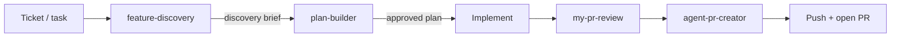
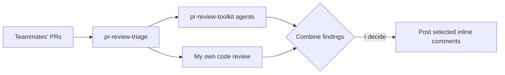
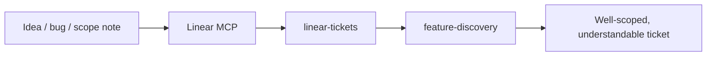
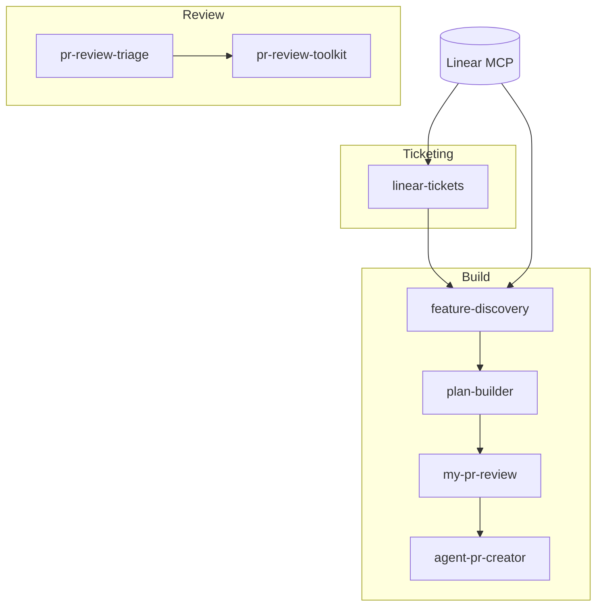

# Workflows

How I actually use these tools together. Three main flows: **building a feature**,
**reviewing other people's PRs**, and **creating tickets**.

---

## 1. Building a feature (my core loop)

For every task I pick up, I run this end to end:

**Step by step:**

1. **`feature-discovery`** — I start *every* task here. It turns the Linear
   ticket into a codebase-grounded discovery brief: scope + acceptance criteria
   cross-referenced with real findings from the codebase (which files, which
   patterns to follow, what to build, which dependencies actually exist).
2. **`plan-builder`** — I take the discovery brief into planning. `plan-builder`
   writes an implementation plan in my house format and **stops for approval** —
   it never rolls straight into code. Once the plan is approved and the work is
   done, I combine it with **`my-pr-review`** to self-review before anyone else
   looks at it.
3. **`agent-pr-creator`** (a.k.a. pr-creator) + push — fills the PR template from
   the diff and commit history, and I push my work.

> **Approval gates:** `plan-builder` and `my-pr-review` both stop for my explicit
> approval. Nothing gets committed, pushed, or opened as a PR without me saying so.

---

## 2. Reviewing other people's PRs

1. **`pr-review-triage`** — lets me review multiple PRs at once. It runs the
   **pr-review-toolkit** agents against each PR's diff *and* I do my own
   code-review pass.
2. I **combine** the agents' findings with mine, then **decide which to post** and
   which to drop. Nothing goes to GitHub until I approve the exact list.

This is strictly for **others' PRs** (outgoing review comments). My own PRs go
through `my-pr-review` instead.

---

## 3. Creating tickets

1. I use the **Linear MCP** to read cycle/ticket state directly (no copy-paste).
2. On top of that I use **`linear-tickets`** to author the ticket in the team's
   house style, and I usually **combine it with `feature-discovery`** so the
   ticket is grounded in the actual codebase — making it far more understandable
   and buildable before anyone picks it up.

---

## How the pieces relate

`feature-discovery` is the hub: it feeds planning *and* ticket authoring.
